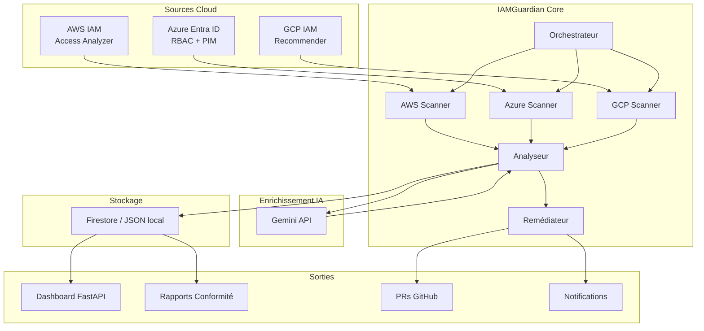
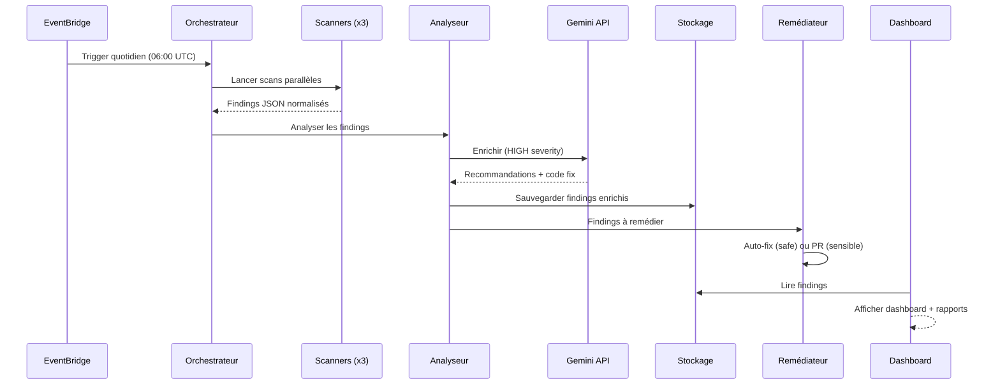
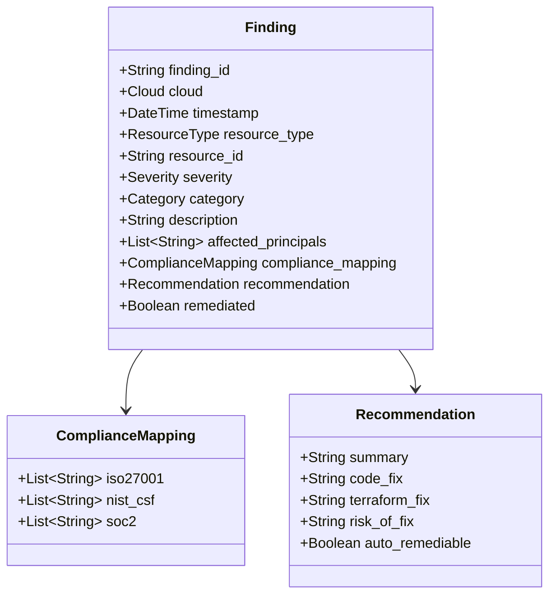
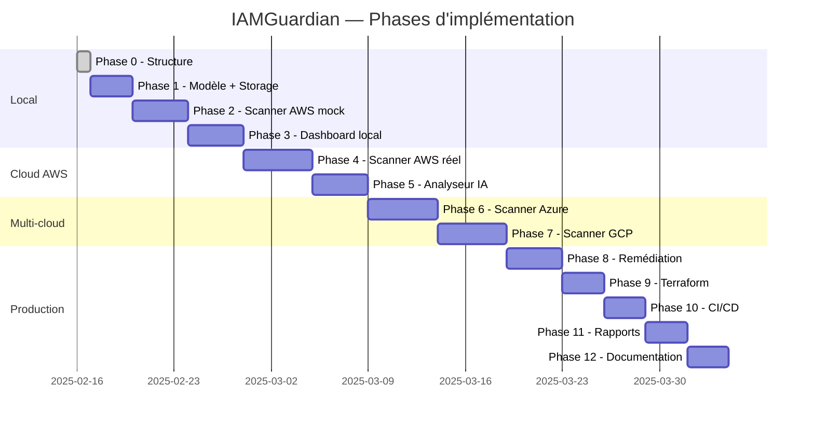

# Architecture IAMGuardian

## Vue d'ensemble

```mermaid
graph TB
    subgraph Sources["Sources Cloud"]
        AWS["AWS IAM<br/>Access Analyzer"]
        Azure["Azure Entra ID<br/>RBAC + PIM"]
        GCP_IAM["GCP IAM<br/>Recommender"]
    end

    subgraph Core["IAMGuardian Core"]
        Orch["Orchestrateur"]
        Scan_AWS["AWS Scanner"]
        Scan_Azure["Azure Scanner"]
        Scan_GCP["GCP Scanner"]
        Analyzer["Analyseur"]
        Remed["Remédiateur"]
    end

    subgraph AI["Enrichissement IA"]
        Gemini["Gemini API"]
    end

    subgraph Storage["Stockage"]
        Store["Firestore / JSON local"]
    end

    subgraph Output["Sorties"]
        Dashboard["Dashboard FastAPI"]
        Reports["Rapports Conformité"]
        PRs["PRs GitHub"]
        Notif["Notifications"]
    end

    AWS --> Scan_AWS
    Azure --> Scan_Azure
    GCP_IAM --> Scan_GCP

    Orch --> Scan_AWS
    Orch --> Scan_Azure
    Orch --> Scan_GCP

    Scan_AWS --> Analyzer
    Scan_Azure --> Analyzer
    Scan_GCP --> Analyzer

    Analyzer --> Gemini
    Gemini --> Analyzer

    Analyzer --> Store
    Analyzer --> Remed

    Remed --> PRs
    Remed --> Notif

    Store --> Dashboard
    Store --> Reports
```

## Flux de données (séquence)

```mermaid
sequenceDiagram
    participant EB as EventBridge
    participant O as Orchestrateur
    participant S as Scanners (x3)
    participant A as Analyseur
    participant G as Gemini API
    participant DB as Stockage
    participant R as Remédiateur
    participant D as Dashboard

    EB->>O: Trigger quotidien (06:00 UTC)
    O->>S: Lancer scans parallèles
    S-->>O: Findings JSON normalisés
    O->>A: Analyser les findings
    A->>G: Enrichir (HIGH severity)
    G-->>A: Recommandations + code fix
    A->>DB: Sauvegarder findings enrichis
    A->>R: Findings à remédier
    R->>R: Auto-fix (safe) ou PR (sensible)
    D->>DB: Lire findings
    D-->>D: Afficher dashboard + rapports
```

## Modèle de données

```mermaid
classDiagram
    class Finding {
        +String finding_id
        +Cloud cloud
        +DateTime timestamp
        +ResourceType resource_type
        +String resource_id
        +Severity severity
        +Category category
        +String description
        +List~String~ affected_principals
        +ComplianceMapping compliance_mapping
        +Recommendation recommendation
        +Boolean remediated
    }

    class ComplianceMapping {
        +List~String~ iso27001
        +List~String~ nist_csf
        +List~String~ soc2
    }

    class Recommendation {
        +String summary
        +String code_fix
        +String terraform_fix
        +String risk_of_fix
        +Boolean auto_remediable
    }

    Finding --> ComplianceMapping
    Finding --> Recommendation
```

## Phases d'implémentation

```mermaid
gantt
    title IAMGuardian — Phases d'implémentation
    dateFormat  YYYY-MM-DD
    section Local
    Phase 0 - Structure       :done, p0, 2025-02-16, 1d
    Phase 1 - Modèle + Storage :p1, after p0, 3d
    Phase 2 - Scanner AWS mock :p2, after p1, 4d
    Phase 3 - Dashboard local  :p3, after p2, 4d
    section Cloud AWS
    Phase 4 - Scanner AWS réel :p4, after p3, 5d
    Phase 5 - Analyseur IA     :p5, after p4, 4d
    section Multi-cloud
    Phase 6 - Scanner Azure    :p6, after p5, 5d
    Phase 7 - Scanner GCP      :p7, after p6, 5d
    section Production
    Phase 8 - Remédiation      :p8, after p7, 4d
    Phase 9 - Terraform        :p9, after p8, 3d
    Phase 10 - CI/CD           :p10, after p9, 3d
    Phase 11 - Rapports        :p11, after p10, 3d
    Phase 12 - Documentation   :p12, after p11, 3d
```
